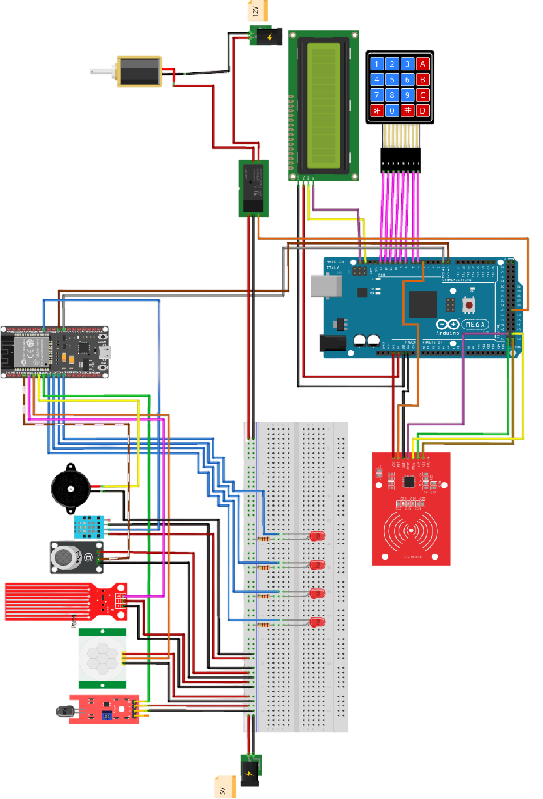

# SaferHouse
## Introduction
SaferHouse is my ([@abdallahmehiz](https://github.com/abdallahmehiz)), [@motazzakoof](https://github.com/motazzakoof) and [@ouchenehichem](https://github.com/ouchenehichem)'s graduation project.

It is a prototype of a home security system made with:
 - Arduinos (ESP32 + Arduino Mega) as the microcontrollers.
 - Spring Boot as the main framework in the back end.
 - A Kotlin Multiplatform app for Android & iOS.

Let's talk about each one

## Arduinos, by [@motazzakoof](https://github.com/motazzakoof)
Through the use of a bunch of microcontrollers, each one responsible for displaying, collecting data or performing actions.

These are the microcontrollers used and tested in this project.

| esp32 | Arduino Mega | 4x4 Keypad | 5 Volts Relay |
|-|-|-|-|
|  |  |  | 
| MQ2 Gas Sensor | DHT11 Sensor | Flame Sensor | Water Sensor
|  |  |  |  |
| Buzzer | IC2 LCD | Motion Sensor | RFID |
|  |  |  |  | 

The final arduino schematics looking like so:



## The front end, by [@abdallahmehiz](https://github.com/abdallahmehiz)

The app has the one job of handling communication between the back end and and the user, informing the user about the state of his house, give him the ability to perform actions and notify him in case of an emergency.

The app was made with the new [Kotlin Multiplatform](https://www.jetbrains.com/kotlin-multiplatform/) technology from JetBrains. so it works on both iOS (Tested it with a hackintosh) and Android.

It was built with Jetpack Compose as its ui library following Google's Clean architectural guidelines with an MVVM architecture.

We've used:
 - [Koin](https://insert-koin.io/): for a dependency injection
 - [Ktor](https://ktor.io/): for networking
 - [Kotlinx Serialization](https://github.com/Kotlin/kotlinx.serialization): for JSON manipulation
 - [Kotlinx DateTime](https://github.com/Kotlin/kotlinx-datetime): for working with dates
 - [SQLDelights](https://cashapp.github.io/sqldelight/2.0.1/): for the app's local database database.
 - [Voyager](https://voyager.adriel.cafe/): for navigation
 - [Multiplatform Settings](https://github.com/russhwolf/multiplatform-settings): for key-value data pairs storage.
 - [KMP Notifier](https://github.com/mirzemehdi/KMPNotifier/): for notifications.
 - [Moko MVVM](https://github.com/icerockdev/moko-mvvm): for multiplatform viewmodels.
 - [Moko Biometry](https://github.com/icerockdev/moko-biometry): for biometrics
 - [Moko Resources](https://github.com/icerockdev/moko-resources): for i18n/l10n
 - [Napier](https://github.com/AAkira/Napier): for logging

And some other small libraries for like [acra](https://www.acra.ch/) for Android crash reporting and few UI specific ones like [Sonner](https://github.com/dokar3/compose-sonner) for toasts and [Materii's PTR](https://github.com/MateriiApps/pullrefresh) for pull to refresh

Here are some screenshots of its homescreen.

|Lights Page| Temps Page | Doors Page | Alarms Page |
|-|-|-|-|
||  |  |  |

The app can be downloaded and tested [here](/profile/app-release.apk).

Note: The app's development cycle was less than 1 months long, and while using relatively new technologies that i weren't, expect bugs and crashes. 

Note #2: To actually use the app, you'll need to self host the backend's api and provide the app with its url. I'll go into hosting it next.

## The back end, by [@abdallahmehiz](https://github.com/abdallahmehiz)

The project's back end was made with Spring Boot and Spring Framework.

A back end that follows *most* of the [CNCF](https://landscape.cncf.io/)'s recommendations for making a cloud native application.

### Self-Hosting
I've made a publicly available Docker Image for the our backend's services all merged together [here](https://hub.docker.com/repository/docker/saferhouse/api). You can choose to pull it by executing 

```
docker pull saferhouse/api:latest
```

and configuring it. or just use this sample docker-compose.yaml file


Note: Be sure to fill in the smtp prompts or the email functionality won't work.

```yaml
version: '3.8'

services:
  database:
    image: mariadb:latest
    restart: always
    hostname: database
    container_name: saferhouse_database
    environment:
      - MARIADB_ROOT_PASSWORD=root
    volumes:
      - safer_house_db:/var/lib/mysql
    networks:
      - saferhouse

  api:
    image: saferhouse/api:latest
    container_name: saferhouse_api
    depends_on:
      - database
    networks:
      - saferhouse
    environment:
      - DATABASE_URL=jdbc:mariadb://database:3306/safer_house
      - DATABASE_USERNAME=root
      - DATABASE_PASSWORD=root
    
      - SERVER_PORT=8888

      - MAIL_HOST= <>
      - MAIL_USERNAME= <>
      - MAIL_PASSWORD= <>
      - MAIL_PORT= <>
    ports:
      - 8888:8888
      - 8889:8889
      - 8890:8890

volumes:
  safer_house_db:

networks:
  saferhouse:
    driver: bridge
    name: safehouse_network
```
